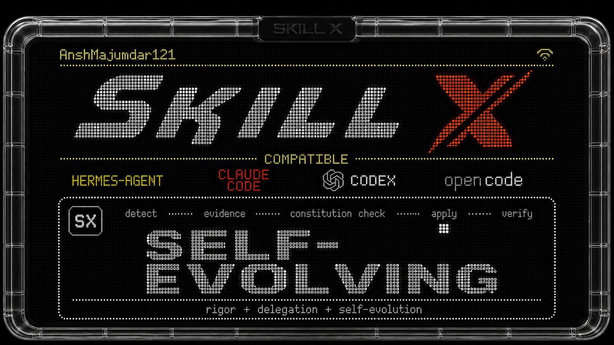

[](../README.md) [](README.es.md) [](README.pt.md) [](README.ja.md) [](README.ko.md) [](README.de.md) [](README.fr.md) [](README.tr.md) [](README.zh-Hant.md) [](README.zh-Hans.md) [](README.ru.md)


[](../LICENSE)
[](#skills-at-a-glance)
[](../skills/super-skill/references/self-evolution.md)

一個小巧、可組合的代理技能（agent skills）集合，用於程式碼、研究與多代理協作。每個技能都是自成一體、以證據為基礎的，並附有漸進式揭露的參考文件。

> 由 [anshmajumdar](https://github.com/anshmajumdar121) 打造。這些技能提煉自公開研究、GPT-5.6 Sol 執行藍圖，以及 [BuilderIO/skills](https://github.com/BuilderIO/skills) 集合。

## 快速開始

```bash
# Clone the repo
git clone https://github.com/anshmajumdar/skill-x.git
cd skill-x

# Pick a skill to install (manual copy)
cp -r skills/think-like-gpt-5-6   ~/.mavis/agents/<your-agent>/skills/
cp -r skills/efficient-fable      ~/.mavis/agents/<your-agent>/skills/
cp -r skills/skill-zero           ~/.mavis/agents/<your-agent>/skills/
cp -r skills/super-skill          ~/.mavis/agents/<your-agent>/skills/

# Or install all of them
for d in skills/*/; do
  cp -r "$d" ~/.mavis/agents/<your-agent>/skills/
done

# Verify they registered
mavis skill list
```

> 將 `<your-agent>` 替換為你的代理名稱（例如 `mavis`、`claude`、`codex` — 也就是你的技能所存放的位置）。

## 技能總覽

| 技能 | 行數 | 功能說明 |
|---|---|---|
| [`think-like-gpt-5-6`](../skills/think-like-gpt-5-6/SKILL.md) | 1,547 | 完整嚴謹框架：7 步驟循環、10 項原則、20 列風險登記表、8 層驗證、6 項核准準則 + 10 項拒絕準則、18 個對抗性審查問題、7 節交付前檢查清單。適用於任何非瑣碎任務。 |
| [`efficient-fable`](../skills/efficient-fable/SKILL.md) | 302 | 委派模式：協調者 + 低成本子代理。5 步驟模式、交接封包格式、驗證協定，在可平行化的工作上可省下 3-5 倍成本並快 2-4 倍。 |
| [`skill-zero`](../skills/skill-zero/SKILL.md) | 1,598 | 專項技能：在編碼代理 LLM 的殘差流（residual stream）上進行線性探針分析。解讀當前程式屬性（格式正確性、完全／部分正確性、回歸）並預測未來最多約 25 步的編輯結果。基於 Silva、Tu 與 Monperrus 2026 年的研究（arXiv:2607.05188）。 |
| [`super-skill`](../skills/super-skill/SKILL.md) | 2,096 | 嚴謹性與委派的綜合體。兩種模式（嚴謹 / 委派）、模式選擇流程、驗證協定、5 項委派專屬風險。**具備自我進化能力**，並受 7 條憲章條款約束。 |

### 該用哪個技能

- **我有一個非瑣碎的任務，並想要可稽核的產出物。**
  → `think-like-gpt-5-6`
- **我有大量程式碼相關工作，可以平行處理，並想節省 token。** → `efficient-fable`
- **我想監控 / 引導編碼代理的內部狀態（機制可解釋性）。** → `skill-zero`
- **我同時想要嚴謹性與委派效率，整合在一個技能中。**
  → `super-skill`
- **我想要一個能隨時間自我改進的技能，並具備防止產出劣質內容的嚴格防護機制。** → `super-skill`（唯一具備自我進化協定的技能）

## 技能詳情

### `/think-like-gpt-5-6`

套用 GPT-5.6 Sol 執行智慧框架。透過 **7 步驟循環**：觀察 → 解讀 → 決策 → 行動 → 驗證 → 修復 → 記錄，將不完整的請求轉化為經過驗證、可稽核的交付成果。背後支撐的是 **10 項指導原則**、**9 階段架構**、**20 列風險登記表**、**6 項核准準則 + 10 項拒絕準則**、**18 個問題的對抗性審查**，以及 **7 節交付前檢查清單**。

適用於：多步驟程式設計、附引用的研究、產出物建立、營運性行動、高風險指引，以及任何你想要可檢視推理過程而非流暢黑盒答案的任務。

延伸閱讀：[skills/think-like-gpt-5-6/SKILL.md](../skills/think-like-gpt-5-6/SKILL.md)

### `/efficient-fable`

使用高成本的前沿模型作為**協調者、架構師、綜合者與最終評判者**。使用較低成本的子代理來執行**有界限的繁重工作**（大規模程式庫掃描、長日誌歸納、局部程式碼修補、瀏覽器／測試驗證）。**驗證協定**指出：*將子代理的報告視為線索而非事實* — 務必重新開啟所引用的檔案、確認行號參照，並在上線前檢視差異（diff）。

**5 步驟委派模式**：指出昂貴的風險點 → 拆分為平行片段 → 使用低成本代理處理繁重工作 → 要求簡潔的證據 → 將協調者的 token 用在決策層。

適用於：可拆分為獨立平行片段的大量程式碼相關工作。對於瑣碎任務、高風險的單一來源工作，或沒有低成本子代理可用時，則應跳過。

延伸閱讀：[skills/efficient-fable/SKILL.md](../skills/efficient-fable/SKILL.md)

### `/skill-zero`

專精於透過殘差流上的線性探針，對**編碼代理 LLM 進行機制可解釋性分析**。基於 Silva、Tu 與 Monperrus 2026 年的研究（[arXiv:2607.05188](https://arxiv.org/abs/2607.05188)）。

此技能教你如何：

- **在編輯落地之前預測結果。** 在隱藏狀態上訓練邏輯回歸探針，以讀出即將寫入的編輯是否會引入回歸（◆ 回歸屬性）或未能通過測試（● 完全正確性）。
- **在軌跡進行中判斷代理是否有進展。** ■ 部分正確性探針能從隱藏狀態中讀出代理對「測試是否會通過」方向的信心程度（論文中 AUC 約為 0.84）。
- **提前約 25 步預見代理的計畫走向。**「潛在程式設計視野」（latent programming horizon）發現：探針可以在多個步驟之前就標記出軌跡正朝向失敗狀態發展。

此技能包含論文中的具體數據（AUC 0.83、視野 k≈25、中間層倒 U 型模式）、4 項標準屬性、打亂標籤的對照組規範、跨基準遷移細節，以及 5 種具體的失效模式。

延伸閱讀：[skills/skill-zero/SKILL.md](../skills/skill-zero/SKILL.md)

### `/super-skill`

綜合體：將**嚴謹性與委派**整合於一個技能中。兩種運作模式：

- **嚴謹模式**（預設）— 使用 GPT-5.6 Sol 的 7 步驟循環、10 項原則、9 階段架構、任務分類、風險登記表、驗證分層、核准／拒絕準則、對抗性審查，以及交付前檢查清單。
- **委派模式** — 適用於可拆分為獨立平行片段的大量程式碼或 token 密集型工作，使用 Efficient Fable 的委派模式搭配驗證協定。

模式在任務接收（intake）階段選定。此技能還包含 **5 項委派專屬風險**（R-D1 至 R-D5）、**第 9 項測試（T-09：子代理報告驗證）**，以及內建於測試矩陣中的驗證協定。

**具備自我進化能力。** 此技能可隨時間成長、改進並自我修剪，並受到嚴格的內部**7 條憲章條款**約束，以防止產出劣質內容。憲章內容（位於 `skills/super-skill/references/self-evolution.md`）：

- **C-1** 以證據為基礎 — 每項變更都必須引用論文、官方文件、程式碼連結或已驗證的觀察結果
- **C-2** 有界範圍 — 僅限嚴謹性與委派框架，不涉及使用者專案
- **C-3** 保守審慎 — 不做推測性新增內容
- **C-4** 品質底線 — 新內容至少要與被取代的內容同等優良
- **C-5** 可回溯 — 每項變更都有變更紀錄列
- **C-6** 防劣質過濾 — 拒絕含糊的填充內容
- **C-7** 隱私 — 不含個人資料，不含專案專屬內容

任一條款不符 = 變更遭拒。沒有例外。

延伸閱讀：[skills/super-skill/SKILL.md](../skills/super-skill/SKILL.md)

## 各技能如何協同運作

<div align="center">

```
        ┌────────────────────────────────┐
        │       使用者任務到達            │
        └───────────────┬────────────────┘
                         │
                         ▼
           ┌────────────────────────┐
           │ 這是什麼類型的任務？     │
           └────────┬───────────────┘
     ┌───────────────────┼────────────────────────┐
     │                   │                        │
  一般任務          需要存取隱藏狀態          我有多個代理，
     │              的程式編碼任務            需要一個統合框架
     │                   │                        │
     ▼                   ▼                        ▼
┌─────────────────┐      ▼                        ▼
│ think-like-     │   ┌─────────────┐   ┌──────────────────┐
│ gpt-5-6         │   │ skill-zero  │   │  super-skill     │
│                 │   │             │   │  （嚴謹+委派，    │
│ 7 步驟循環      │   │ 對隱藏狀態  │   │   可自我進化）    │
│ 10 項原則       │   │ 進行線性    │   │                  │
│ 風險登記表      │   │ 探針分析    │   └──────────────────┘
│ 驗證機制        │   └─────────────┘            │
└────────┬────────┘                              │
         │                                        │
         └──────────────────┬─────────────────────┘
                             │
                             ▼
                ┌─────────────────────┐
                │ efficient-fable     │
                │ （委派模式）         │
                │                     │
                │ 5 步驟模式，        │
                │ 交接封包，          │
                │ 驗證協定            │
                └─────────────────────┘
                             ▲
                             │
          在 super-skill 的委派模式中被使用
          也可獨立用於 token 密集型的平行工作
```

</div>

`super-skill` 是大多數複雜任務的建議預設選項。它包含：

- 完整的 TLG 嚴謹框架（作為外層循環）
- Efficient Fable 委派模式（作為快速通道）
- 自我進化協定（含 7 條憲章條款）

其餘三個技能仍可依各自的特定觸發情境使用。

## 安裝

這些技能設計為可直接放入任何代理的技能目錄中。共有三種安裝路徑 — 挑選你的代理支援的方式即可。

### 路徑 A — 外掛 / 市集安裝（建議）

本倉庫同時以 **Claude Code 外掛市集**與 **Codex 外掛**的形式發佈，因此你可以用一行指令安裝：

```bash
# Claude Code
/plugin marketplace add anshmajumdar/skill-x
/plugin install skill-x@skill-x

# Codex
codex plugin install anshmajumdar/skill-x

# Or generic npx (Vercel's skills CLI)
npx skills@latest add anshmajumdar/skill-x --skill super-skill
```

完整的各代理安裝對照表（Claude Code、Codex、OpenCode、Copilot，以及通用的 `cp -r` 備用方式）請見 [PLUGIN_INSTALL.md](../PLUGIN_INSTALL.md)。

### 路徑 B — 手動安裝（適用於任何代理）

```bash
# Clone
git clone https://github.com/anshmajumdar/skill-x.git
cd skill-x

# Install one
cp -r skills/super-skill ~/.mavis/agents/<your-agent>/skills/

# Install all
for d in skills/*/; do
  cp -r "$d" ~/.mavis/agents/<your-agent>/skills/
done

# Verify
mavis skill list
```

### 各代理的安裝路徑

| 代理 | 技能路徑 | 是否支援外掛？ |
|---|---|---|
| mavis | `~/.mavis/agents/<name>/skills/` | 不適用 |
| Claude Code | `~/.claude/skills/`（使用者層級）或 `.claude/skills/`（專案層級） | 支援 — `.claude-plugin/marketplace.json` |
| Codex CLI | `~/.codex/skills/`（使用者層級）或 `.codex/skills/`（專案層級） | 支援 — `.codex-plugin/plugin.json` |
| OpenCode | `~/.config/opencode/skills/`（使用者層級）或 `.opencode/skills/`（專案層級） | 僅手動安裝 |
| GitHub Copilot | `.github/skills/`（專案層級）或 VS Code 使用者目錄 | 僅手動安裝 |

### 驗證技能是否安裝成功

```bash
# Lint a single skill
node $(mavis skill show skill-creator | python3 -c 'import json,sys;print(json.load(sys.stdin)["location"])' | xargs dirname)/scripts/lint-skill.js skills/super-skill/

# Lint all skills in this repo
./scripts/lint-all.sh
```

## 自我進化（僅限 `/super-skill`）

<br>



<br>

`super-skill` 是唯一具備自我進化能力的技能。相關協定位於
[`skills/super-skill/references/self-evolution.md`](../skills/super-skill/references/self-evolution.md)。
觸發條件：

- **明確指令**：「evolve this skill」、「superskill evolve」
- **過時內容偵測**：某個具體的數字、連結或說法已明顯過時
- **更佳技術偵測**：出現明顯更好的技術
- **劣質內容偵測**：某個段落已不再具有存在的價值

5 步驟流程：偵測 → 佐證 → 憲章檢核（全部 7 條條款）→ 套用 → 驗證（重新 lint）。`super-skill/SKILL.md` 頂部的變更紀錄會記錄每一次變更。

## 貢獻方式

我們歡迎貢獻。工作流程請見 [CONTRIBUTING.md](../CONTRIBUTING.md)，關於品質標準的指引，請參考技能內建的**自我進化協定**。簡而言之：

1. 每個技能都應自成一體，請保持這個特性。
2. 參考文件採漸進式揭露 — `SKILL.md` 是前導說明，`references/*.md` 是詳細內容。
3. 必須通過 Lint 檢查：`./scripts/lint-all.sh`。
4. 執行期間不得有外部網路呼叫。技能皆為靜態 Markdown。
5. 不含個人資料，不含專案專屬內容。

## 這些技能是如何打造的

| 技能 | 來源 | 綜合內容 |
|---|---|---|
| `think-like-gpt-5-6` | GPT-5.6 Sol 執行智慧藍圖（v1.0，2026-07-16） | 提煉為 7 步驟循環、10 項原則、9 階段架構、20 列風險登記表 |
| `efficient-fable` | [BuilderIO/skills](https://github.com/BuilderIO/skills/tree/main/skills/efficient-fable) | 重新調整：擴展至 Fable 之外的通用範圍，新增「何時不該使用」，並與集合中其他技能交叉參照 |
| `skill-zero` | Silva、Tu、Monperrus 2026 年研究（[arXiv:2607.05188](https://arxiv.org/abs/2607.05188)） | 擷取線性探針方法論、4 項標準屬性、預期 AUC 數值、5 種失效模式 |
| `super-skill` | `think-like-gpt-5-6` 與 `efficient-fable` 的綜合體 | 新增 5 項委派專屬風險、模式選擇流程、驗證協定、第 9 項測試 T-09、含 7 條憲章條款的自我進化協定 |

## 授權條款

MIT。詳見 [LICENSE](../LICENSE)。

## 相關連結

- [PLUGIN_INSTALL.md](../PLUGIN_INSTALL.md) — 完整的各代理安裝對照表（Claude Code、Codex、OpenCode、Copilot、手動安裝）
- [CONTRIBUTING.md](../CONTRIBUTING.md) — 如何新增或修改技能
- [LICENSE](../LICENSE) — MIT
- [SECURITY.md](../SECURITY.md) — 如何回報安全性問題
- [CITATION.cff](../CITATION.cff) — 如何引用本集合
- [.github/workflows/lint-skills.yml](../.github/workflows/lint-skills.yml) — 用於檢查每個技能的 CI
- [scripts/lint-all.sh](../scripts/lint-all.sh) — 本地端等效工具
- [.claude-plugin/marketplace.json](../.claude-plugin/marketplace.json) — Claude Code 外掛清單
- [.codex-plugin/plugin.json](../.codex-plugin/plugin.json) — Codex 外掛清單

---

以嚴謹性 + 委派 + 7 條憲章打造。如果覺得有用，請給個星星。
