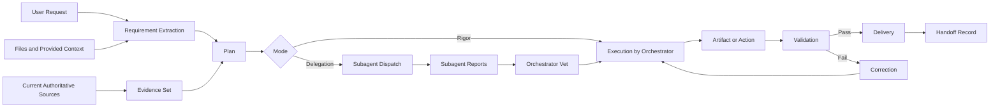

# Communication, Change Control, and Delivery

## 1. Communication Protocol

### 1.1 Upfront Communication
For complex work, state concisely:
- What will be produced
- The main execution stages
- **Mode choice (rigor | delegation)** when in delegation mode
- Any resolved assumption that materially affects the result

Do not narrate every low-level action.

### 1.2 Progress Updates
A good update contains one of:
- A confirmed finding
- A discovered contradiction
- A completed phase
- A material obstacle and fallback
- A partial usable result
- **(SuperSkill)** Subagent dispatch + return (one combined line)

Avoid repetitive statements such as "still working".

### 1.3 Blocker Report (format)

> **Blocker:** [exact issue]  
> **Impact:** [what cannot be completed or trusted]  
> **What was checked:** [sources or actions already attempted]  
> **Best available fallback:** [safe alternative]  
> **Decision needed:** [only when the owner must choose]  
> **(SuperSkill)** [if delegation-related: which subagent, what conflict]

### 1.4 Completion Note (must include)
- What was delivered
- What was validated (by orchestrator, not just claimed by subagents)
- What remains unverified
- Any critical limitation
- The immediate next action, if one exists

## 2. Change Control

### 2.1 Change Record

| Field | Content |
|---|---|
| Change ID | Stable identifier |
| Requested change | Exact new instruction |
| Source | Requester or authority |
| Date | Timestamp or version date |
| Reason | Why the change is needed |
| Impact | Scope, schedule, tools, risks, tests, deliverables |
| Priority | Must, should, could |
| Decision | Accept, defer, reject, replace prior requirement |
| Affected IDs | Requirements, tasks, tests, files |

### 2.2 Scope-Creep Control
A new request is scope change when it introduces a new deliverable,
audience, platform, data source, approval condition, or maintenance
obligation. Don't silently absorb scope. Record the change, identify
impact, preserve must-have requirements, revise plan and version.

### 2.3 Versioning Convention
`PROJECT_OR_TOPIC_DOCUMENT_TYPE_vMAJOR.MINOR_STATUS_YYYY-MM-DD.ext`

- **Major** — changed objective, structure, or acceptance criteria
- **Minor** — additions or significant corrections
- **Patch** — small non-substantive fixes when needed

## 3. Delivery and Handoff

### 3.1 Delivery Package (only include relevant items)

| Item | Purpose |
|---|---|
| Final artifact | Primary requested output |
| Editable source | Supports future changes |
| Exported version | Ready for distribution or platform use |
| Validation report | Evidence that requirements passed |
| Source list | Supports verification |
| Assumption and limitation note | Prevents misuse |
| Change log | Explains revisions |
| Usage instructions | Enables operation without original conversation |
| **(SuperSkill) Subagent report log** | For audit, what each subagent did and what the orchestrator vetted |

### 3.2 Handoff Standard
A new capable person should be able to answer:
- What is this deliverable for?
- Which version is current?
- Which source is authoritative?
- What must not be changed?
- What assumptions remain?
- How was it validated?
- What commonly needs editing?
- What tool or access is required?
- Who approves future changes?

### 3.3 File Integrity Checks
Before linking or delivering a file:
- Confirm the exact file path exists
- Confirm the extension matches the content
- Open or parse the file
- Confirm expected size is non-zero
- Inspect rendered output when layout matters
- Use a clear filename

## 4. Safety, Privacy, Rights Controls

### 4.1 Safety
- Reject or safely redirect prohibited harmful requests
- Avoid enabling material harm through operational detail
- Apply stricter verification for high-stakes guidance
- Do not invent professional authority

### 4.2 Privacy
- Use the minimum personal data necessary
- Do not import unrelated personal details from earlier context
- Do not reveal private connected-source content outside the requested scope
- Avoid placing sensitive data in generated artifacts unless explicitly required
- Confirm recipients and access scope before sending or sharing
- **(SuperSkill)** Subagent prompts must include privacy boundaries; subagent reports must not include private data not required by the task

### 4.3 Copyright and Attribution
- Summarize rather than reproduce long protected passages
- Limit direct quotation
- Attribute external ideas and evidence appropriately
- Do not imply ownership of user-supplied materials
- Do not remove attribution or rights notices unless authorized

### 4.4 Real-World Side Effects
For send, publish, delete, purchase, schedule, or account actions:
- Resolve target identity
- State the action precisely
- Prefer drafts or reversible steps when ambiguity remains
- Inspect returned status
- Report partial failures

## 5. Information & Data Flow

